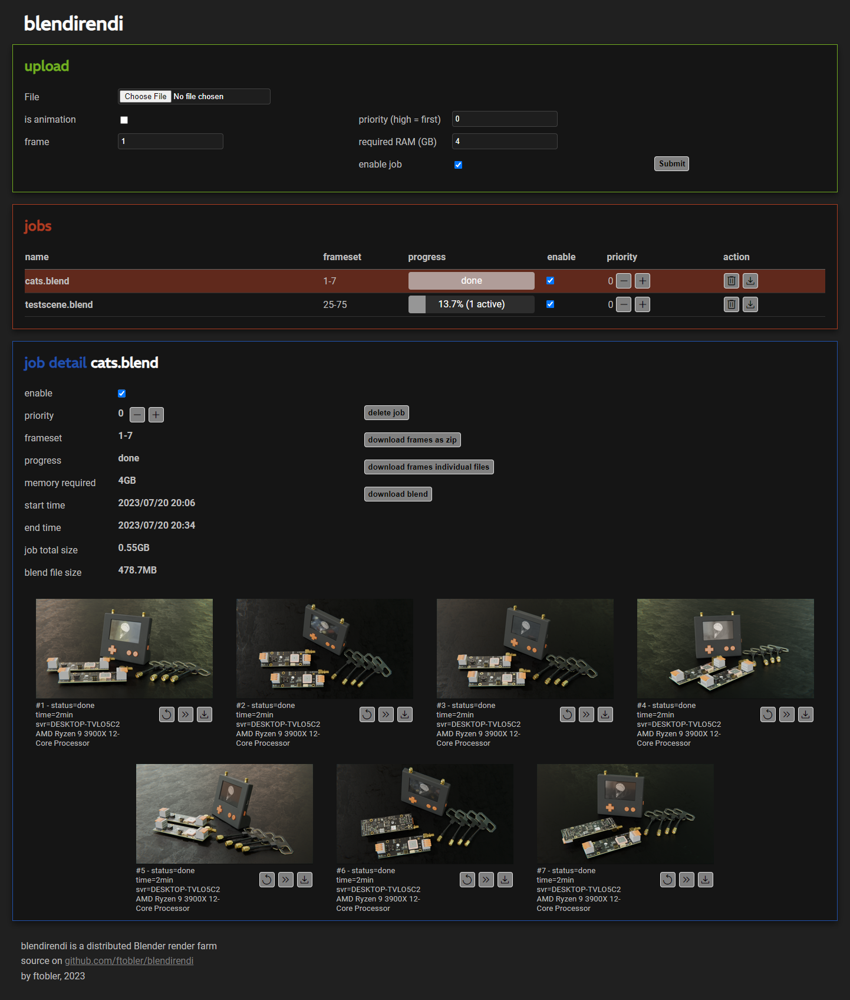
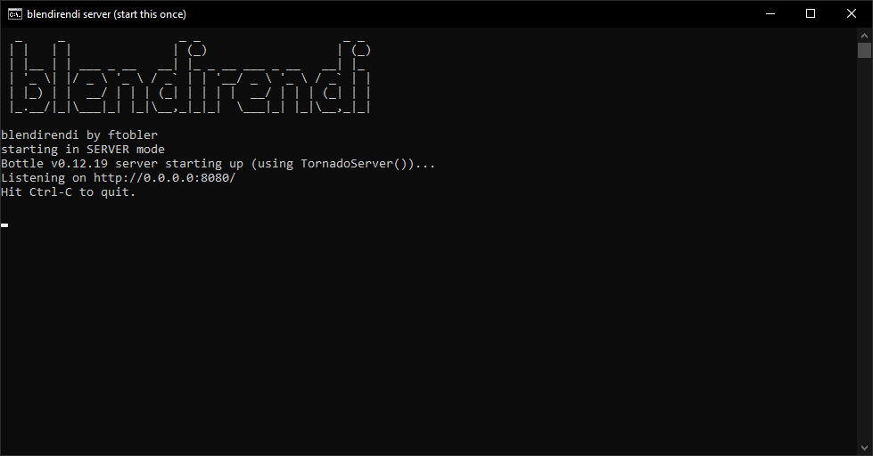
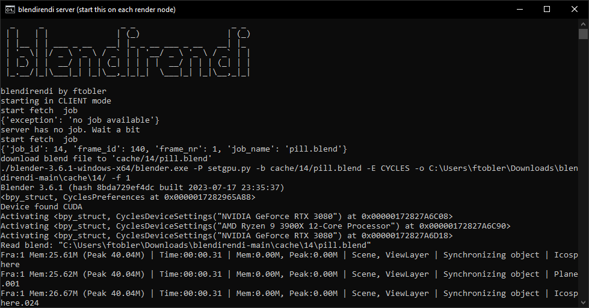

# blendirendi

Blendirendi is a distributed Blender render farm. It features a server with a web-based GUI for management and multiple clients that handle the rendering. The clients can run on multiple machines within the same network.

Features:

* Single frame or animation mode
* CPU and GPU rendering, based on what is set in the Scene
* Use any version of Blender.
* Any number of render clients
* Max memory setting for weak clients
* Job priority management
* Job enable/disable
* Image download as *.zip or single files
* Blend file download
* Drag and drop upload
* Built-in image viewer
* Reset/skip frames feature
* server-side disk usage monitoring

Limitations:

* Output format must be *.png.
* Rendering Engine must be Cycles.
* Limited error handling if a client can't render the scene for any reason (it might get stuck and try again later indefinetly)
* Denoising breaks clients running in some VMs. If possible you need to enable SSE4.1. (e.g in Proxmox enable 'HostType')
* Each frame is rendered in full by a client; no image stacking.
* *.zip file download might break the server if the archive gets too big
* No client management from the web GUI
* No user login
* Manual configuration needed in *.json file

Under the hood:

* Written in Python
* Bottle web server with Tornado*
* SQLite database
* Single-page web frontend with Vue

*I am aware that it is not written to be stateless, since I don't need it to be.

# Images

# Installation

Clone the git repository to your machine.

Download the Blender version of your choice as a *.zip portable installation. Unpack it into the _blendirendi_ root folder. The folder is normally named something like ``blender-3.6.1-windows-x64``.

Edit ``blendirendi.json`` and make the following changes:

* Set the key ``client.blender_path`` to the blender executable inside your Blender installation. E.g.: ``./blender-3.6.1-windows-x64/blender.exe``
* Set the key ``server_url`` to the URL where the client can reach the server. E.g.: ``http://192.168.1.50:8080``. Make sure you have the same port set as in ``server.port``. DO NOT EXPOSE blendirendi TO THE PUBLIC WEB!

Start _blendirendi_ on the server machine using the command ``python blendirendi.py server``.

Start _blendirendi_ on the client machine(s) using the command ``python blendirendi.py client``. You can start the server and client from the same installation if your server should also be a rendering machine. However, if you want to start the client more than once on a machine, then you need a separate installation of blendirendi for each instance.

I hope everything also works under Linux.

# Data management

Your user data is stored in the following files:

* blendirendi.json
* blendirendi.db
* data/

The client only needs the file ``blendirendi.json``, but it will create a ``cache`` folder.

## Happy Render Time :)

